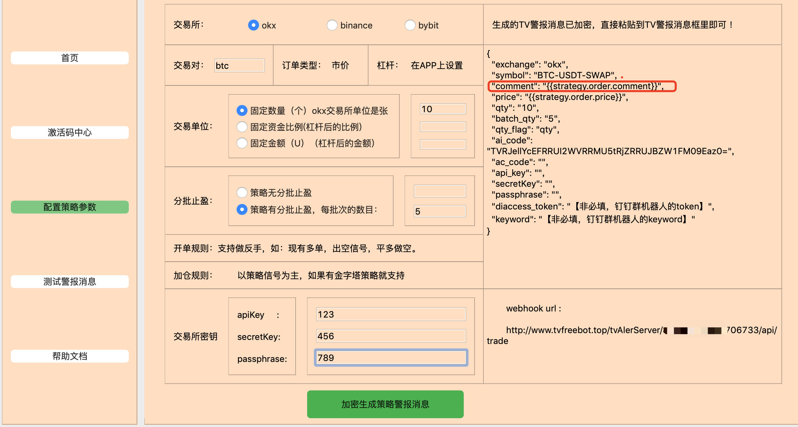
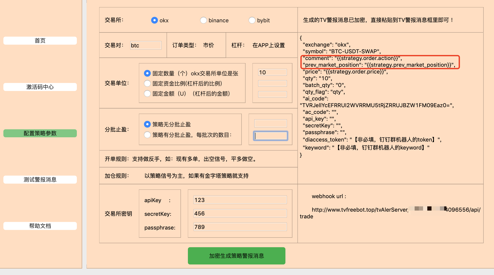
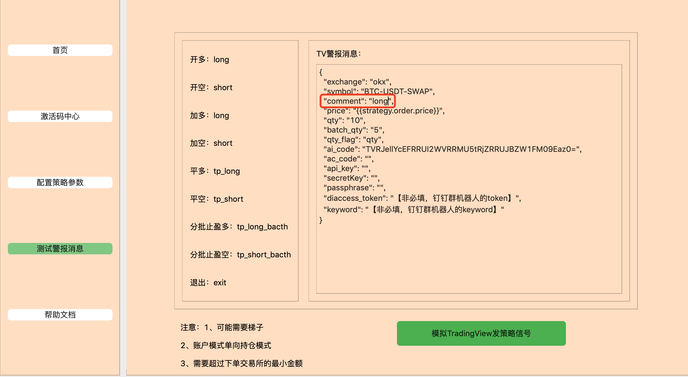
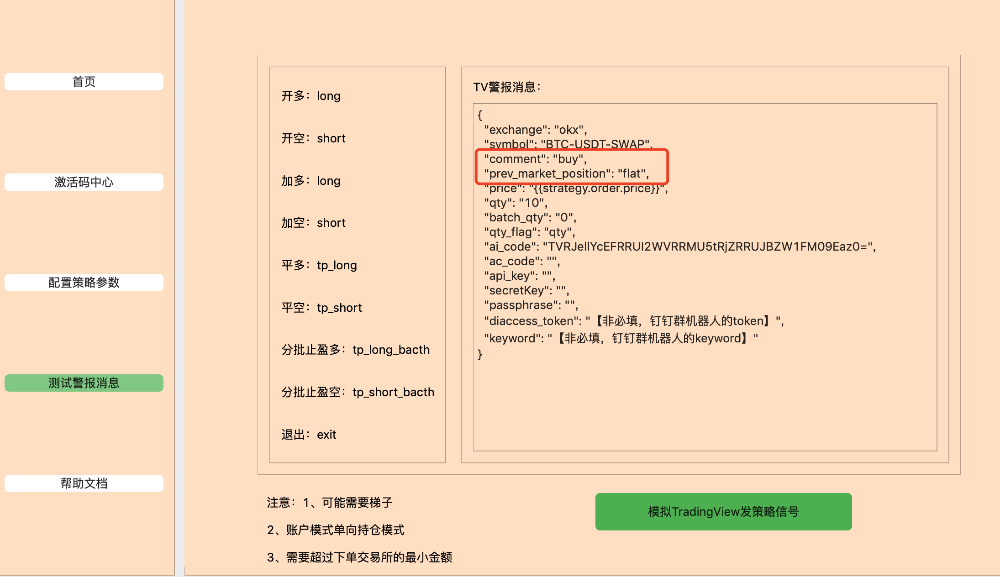
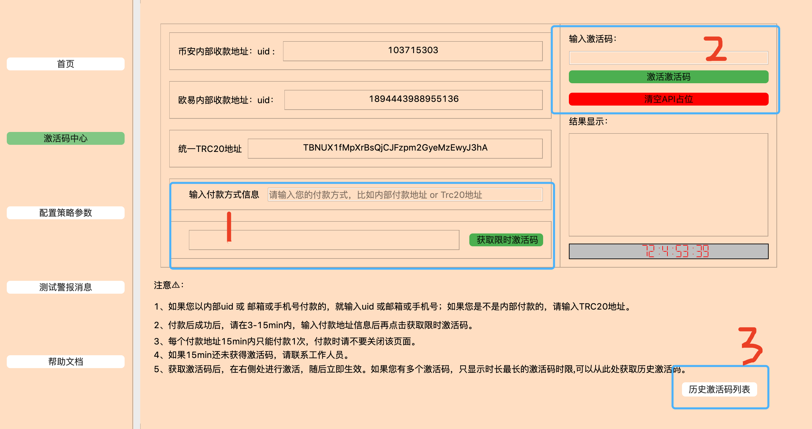
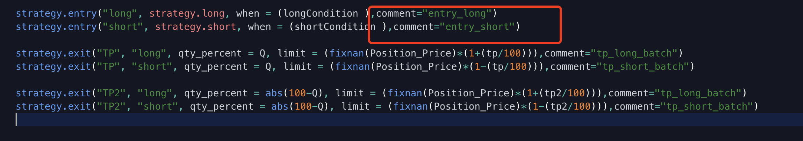
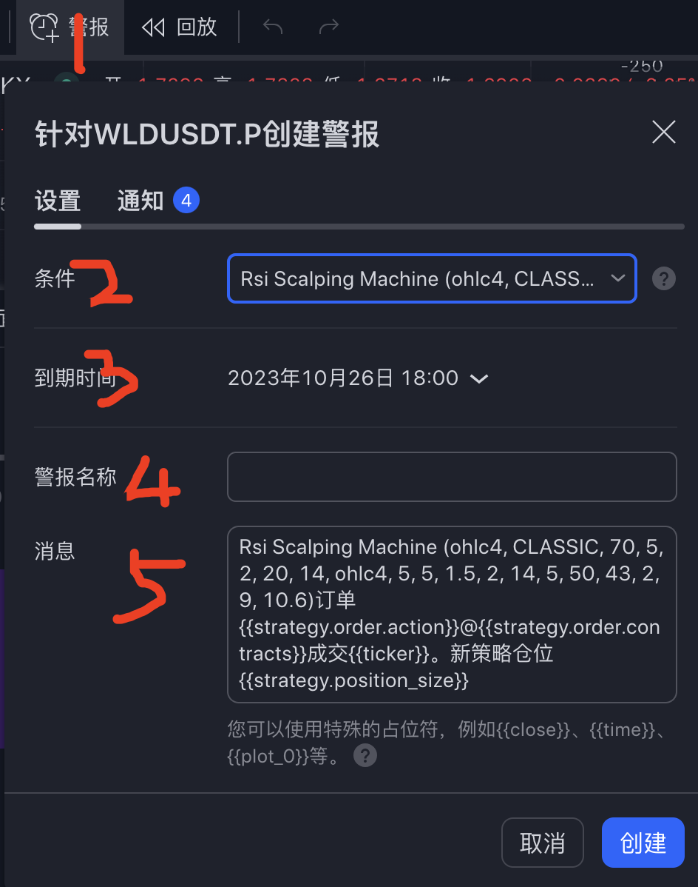
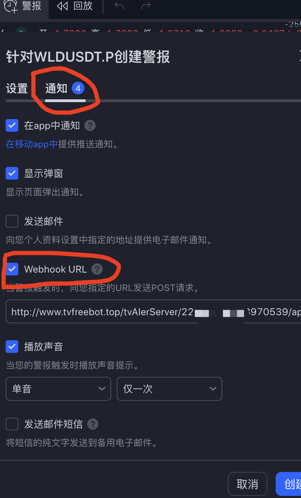

### TradingView 策略自动交易工具白嫖教程

### 0、介绍

​		TradingView策略自己交易工具分为客户端和服务端。服务器端是负责在服务器上接收策略交易信号，客户端负责是把警报消息生成的。支持OKX\Binance\Bybit等主流交易所合约市场。支持固定数量、固定金额以及固定总资金比例，支持分批止盈策略。支持交易所api信息加密传输和不加密传输，支持钉钉消息转发下单过程等功能。OKX设置了永久免费使用，不限制API数目，Binance\Bybit 交易所设置了收费规则，以保证整个项目的经费运行，限制每个交易所的API最大为5个，如果超过就需要清除一下继续可以使用。TradingView 警报信息生成工具，直接支持windows和macos系统，下载即用无需安装依赖环境。主要包括警报消息生成、警报消息测试、激活码中心、学习文档，欢迎点赞收藏和转发。


### 1、客户端使用方法🔥🔥🔥

​		客户端支持了windows应用和macos应用，但不保证每一台机器运行的正常，（如果不正常可以查看不用使用客户端依然可以白嫖运行的方法）。目前客户端有3个模块，第一个根据用户策略配置需求进行选择配置警报消息参数，并生成警报消息。第二个是使用生成的警报消息进行测试是否能下单，确保在TV上自动交易可以自动运行。第三个，自动收费入口和自动清空API占位（当满5个API时使用）入口。接下来就从以下内容进行介绍：

##### 1.1下载安装

 		 在此页面根据你的系统下载对应的系统的可执行程序。

 		 windows版本需要解压后，执行后缀为exe的文件即可。可能存在分辨率的问题，可以使用***不用使用客户端依然可以白嫖的方法***

 		 macos 版本直接双击即可。或者打开终端，把runBot_macos拖进去 enter一下。如果还是不行，可能mac自动把它识别成了文件，需要一次转化，转化步骤：

```python
打开终端,输入命令：chmod +x 空格 然后 把runBot_macos拖进去 enter一下就可以了，之后就直接可以双击打开了。
```

 		有些页面需要梯子，windows版本如果电脑有杀毒软件尽量关闭，可能会被识别为恶意软件。

##### 		1.2 警报消息生成模块

​		基本操作流程：

​		打开软件，选择***配置策略参数***

​		a、点选一个交易市场

​		b、***交易对*** 举个例子：直接大写BTC  那么okx那边自动匹配到BTC-USDT-SWAP

​		c、***交易单位***  ：

​	固定数量：就是你下多少个币，okx那边是张，也就是你下多少张。之前1.0版本就是支持的固定数量。后面是数字即可，如果是币可以是小数，如果是张必须是整数。

​	固定金额：就是你下多少U，这个U是你乘以杠杆后的金额。如果你下100U，10倍 那么保证金就是10U。

​	固定资金比例：就是你剩余多少U的资金比例。这个也是杠杆后的资金比例，也算是你剩余后的资金乘以杠杆后的资金比例。比如你剩余100U，10倍，你下 0.1 （10%），那么你需要填写 1（0.1 * 10倍 =1） ，其实就是100U *10能开的最大资金的0.1 。

​		d、***分批止盈***:

​	有些策略没有分批止盈的，有些策略是有的，因此你需要根据情况自动选择。

​	没有分批止盈的可以直接点选一下就行，不需要填写。

​	有分批止盈的，需要做2个事情，第一个事情，要适配TradingView 策略的 comment，也就是在你策略源码里添加备注的方式，不影响策略本身，如何添加适配请看***如何对接自己的TradingView策略实现自动交易***🔥;	第二个事情，就是在后面填写每次止盈的多少的数字。如果你选择固定数量，比如100，你的策略有2次分批止盈，那么你就可以填写50，如果你有3次分批止盈，那么需要填写34稍微比平均值大一点就行。如果你选择的是固定金额，那么每次分批止盈的就是每次止盈多少金额。如果除不尽就比平均值大一点就行。比如你杠杆后下了100U，分2次，那么就填写50 ；如果你是固定资金比例，那么每次分批止盈就是每次止盈多少仓位的比例。如果你现在选择的固定资金比例方式下单的，杠杆后填写1（实际是0.1），那么分2次止盈的话，那么就是0.5。当然不明白的，可以通过测试警报消息模块，可以测试测试，当然也可以咨询群主。

​	这个分批止盈模块实现比较复杂，逻辑比较多，请多理解学习一下，我本人比较喜欢固定数量，因为简单。毕竟刚开始开发的时候就是固定数量，等资金上来了可以随时修改这个值，已达到复利的目的。

​		e、***交易所API 填写***

​		本着账号安全的角度考虑，服务端数据库不会存储用户的账号信息，以及防止api信息的泄露，此处进行了api信息的加密操作，它会自动生成一个ai_code，作为我们交易的唯一标记。如果你不想加密，就不需要填写。后面生成了警报，可以自行填写api信息。

​		f、***不同的Tv警报消息***

​		根据策略的不同分为，策略无分批止盈和有分批止盈，它们对应的TV警报消息是不同的。

​		仔细观察就知道，分批止盈的commet 是 ***{{strategy.order.comment}}***,它是需要用comment备注的方式来实现的分批止盈和交易方向的，因此 需要在策略源码上做一些修改。而无分批止盈的comment是用***{{strategy.order.action}}***和新增字段信息prev_market_position来实现的交易方向的。

策略有分批止盈的情况:



策略无分批止盈的情况：



##### 		1.2 本地测试警报消息

​		该模块主要是模拟TradingView触发警报时发生警报的过程。复制刚刚生成的警报消息，（如果你不加密，自己添加自己的api 信息。），仅仅根据策略出现的情况，进行手动修改，然后点击发送进行查看账号是否下单。下单成功表示成功。注意：交易所账户必须是单向持仓模式或者买卖模式。这一点很重要。测试前必须设置好，杠杆倍数自己在交易所APP上自己设置即可。接下来模拟一个例子来说一下这个测试的过程：

⚠️策略有分批止盈下单情况：

做多

就是手动修改comment的值为***long***进行模拟tv发做多信号。



平多

同理，手动修改comment的值为***tp_long***进行模拟tv发平多信号。

分批止盈多

同理，手动修改comment的值为***tp_long_batch***进行模拟tv发平多信号。

以此类推，具体值参考左侧。


⚠️策略无分批止盈下单情况（也就是只有开多，平多，开空，平空）：

​	就不能参考左侧的了，commemt取值范围只有buy和sell这两种； prev_market_position(表示仓位持仓之前的状态)，取值范围只有flat（无仓位）、long（多仓）、short（空仓）这三种。

开多的情况：

comment 表示策略动作，现在是做多，那么就是***buy***;

prev_market_position为下单前是没有仓位的，因此是是***flat***



平多

同理，手动修改comment的值为***sell***,prev_market_position改为***long**进行模拟tv发平多信号。

开空

同理，手动修改comment的值为***sell***,prev_market_position改为***flat**进行模拟tv发做空信号。

平空

同理，手动修改comment的值为***buy***,prev_market_position改为***short**进行模拟tv发平空信号。


##### 		1.3 购买限时时长方法

由***激活码中心***进入，选择套餐点击购买，当然你也会看到有个永久免费的入口那就是okx!!!***兄弟们可以白嫖了*** 😄



​		本页面包括3个部分内容，

​		第一是自助付款页面，可以有三种方式进行付款，币安内部、okx内部、以及统一地址转账。复制下来进行购买即可。转账完毕后，输入付款的方式信息获取激活码，请在15min内操作完毕，尽可能看到已经转账成功后1-3min后进行操作，比较区块链有个区块确认到帐时间。注意⚠️：***如果你是内部地址付款的，请输入邮箱账号或者手机号进行获取，如果你是统一地址转账的，请输入trc20地址。如果以上都获取不了，且付款了。请与工作人员联系。***

​		第二是激活激活码，并不是买了激活码就可以使用的，需要激活，输入激活码进行激活即可，这个时候倒计时就会显示你有多少时间。当你这个激活码同一个交易所被5个不同的api都使用的时候可以点击清空API占位，然后继续可以使用。也就是同一个交易所最大API交易数量为5个。

​		第三是查看历史激活码。这个只是记录你购买的记录情况，有时候忘记激活码可以在这里获取，刚开始购买不能立马显示，需要关闭后重新打开即可。

##### 		1.4 不用使用客户端依然可以白嫖🔥

​	如果你的电脑下载应用后，出现问题，那么就可以使用以下模版消息，自己手动填写对应的信息即可。这样TV警报消息依然有效。但无法进行自己模拟TV测试了。切记，账户一定是***单向持仓模式或者买卖模式***！！！

***固定数量***模式下的模版消息：

***模版1：策略有分批止盈--api加密的模版***

api加密可以找群主替你加密。

比如每次信号来下btc合约10个或者10张，分批止盈每次5个或者5张此时的qty_flag 表示qty，固定数量模式。

```json
{
  "exchange": "okx",
  "symbol": "BTC-USDT-SWAP",
  "comment": "{{strategy.order.comment}}",
  "price": "{{strategy.order.price}}",
  "qty": "10",
  "batch_qty": "5",
  "qty_flag": "qty",
  "ai_code": "TVRJellYcEFRRUI2WVRRMU5tRjZRRUJBZW1FM09Eaz0=",
  "ac_code": "",
  "api_key": "",
  "secretKey": "",
  "passphrase": "",
  "diaccess_token": "【非必填，钉钉群机器人的token】",
  "keyword": "【非必填，钉钉群机器人的keyword】"
}
```


***模版2：策略有分批止盈--api不加密的模版***

api_key、secretKey、passphrase需要自己填写

```json
{
  "exchange": "okx",
  "symbol": "BTC-USDT-SWAP",
  "comment": "{{strategy.order.comment}}",
  "price": "{{strategy.order.price}}",
  "qty": "10",
  "batch_qty": "5",
  "qty_flag": "qty",
  "ai_code": "",
  "ac_code": "",
  "api_key": "",
  "secretKey": "",
  "passphrase": "",
  "diaccess_token": "【非必填，钉钉群机器人的token】",
  "keyword": "【非必填，钉钉群机器人的keyword】"
}
```


***模版3：策略无分批止盈--api加密的模版***

api加密可以找群主替你加密。

```json
{
  "exchange": "okx",
  "symbol": "BTC-USDT-SWAP",
  "comment": "{{strategy.order.action}}",
  "prev_market_position": "{{strategy.prev_market_position}}",
  "price": "{{strategy.order.price}}",
  "qty": "10",
  "batch_qty": "0",
  "qty_flag": "qty",
  "ai_code": "TVRJellYcEFRRUI2WVRRMU5tRjZRRUJBZW1FM09Eaz0=",
  "ac_code": "",
  "api_key": "",
  "secretKey": "",
  "passphrase": "",
  "diaccess_token": "【非必填，钉钉群机器人的token】",
  "keyword": "【非必填，钉钉群机器人的keyword】"
}
```


***模版4: 策略无分批止盈--api不加密的模版***

api_key、secretKey、passphrase需要自己填写

```json
{
  "exchange": "okx",
  "symbol": "BTC-USDT-SWAP",
  "comment": "{{strategy.order.action}}",
  "prev_market_position": "{{strategy.prev_market_position}}",
  "price": "{{strategy.order.price}}",
  "qty": "10",
  "batch_qty": "0",
  "qty_flag": "qty",
  "ai_code": "",
  "ac_code": "",
  "api_key": "",
  "secretKey": "",
  "passphrase": "",
  "diaccess_token": "【非必填，钉钉群机器人的token】",
  "keyword": "【非必填，钉钉群机器人的keyword】"
}
```


⚠️如果你想下***固定金额***，那么qty、batch_qty 、qty_flag 意义就不一样了。qty 和 batch_qty分别表示杠杆后的金额。此时的qty_flag的值是money，请看一个例子：

​		有分批止盈的情况

​		下杠杆后100u的btc合约，每次平50u，此时的qty_flag为money

```json
{
  "exchange": "okx",
  "symbol": "BTC-USDT-SWAP",
  "comment": "{{strategy.order.comment}}",
  "price": "{{strategy.order.price}}",
  "qty": "100",
  "batch_qty": "50",
  "qty_flag": "money",
  "ai_code": "TVRJellYcEFRRUI2WVRRMU5tRjZRRUJBZW1FM09Eaz0=",
  "ac_code": "",
  "api_key": "",
  "secretKey": "",
  "passphrase": "",
  "diaccess_token": "【非必填，钉钉群机器人的token】",
  "keyword": "【非必填，钉钉群机器人的keyword】"
}
```

​		无分批止盈的情况

​		下杠杆后100u的btc合约，此时的qty_flag为money

```json
{
  "exchange": "okx",
  "symbol": "BTC-USDT-SWAP",
  "comment": "{{strategy.order.action}}",
  "prev_market_position": "{{strategy.prev_market_position}}",
  "price": "{{strategy.order.price}}",
  "qty": "100",
  "batch_qty": "0",
  "qty_flag": "money",
  "ai_code": "TVRJellYcEFRRUI2WVRRMU5tRjZRRUJBZW1FM09Eaz0=",
  "ac_code": "",
  "api_key": "",
  "secretKey": "",
  "passphrase": "",
  "diaccess_token": "【非必填，钉钉群机器人的token】",
  "keyword": "【非必填，钉钉群机器人的keyword】"
}
```


⚠️如果你想下***固定资金比例***，那么qty 和 batch_qty分别表示杠杆后的资金比例。此时的qty_flag的值是money_rate

​		有分批止盈的情况

​		比如你现在杠杆是10倍，想下资金的10%，每次平5%，此时的qty_flag为money_rate

```json
{
  "exchange": "okx",
  "symbol": "BTC-USDT-SWAP",
  "comment": "{{strategy.order.comment}}",
  "price": "{{strategy.order.price}}",
  "qty": "1",
  "batch_qty": "0.5",
  "qty_flag": "money_rate",
  "ai_code": "TVRJellYcEFRRUI2WVRRMU5tRjZRRUJBZW1FM09Eaz0=",
  "ac_code": "",
  "api_key": "",
  "secretKey": "",
  "passphrase": "",
  "diaccess_token": "【非必填，钉钉群机器人的token】",
  "keyword": "【非必填，钉钉群机器人的keyword】"
}
```

​		无分批止盈的情况

​		比如你现在杠杆是10倍，想下资金的10%，此时的qty_flag为money_rate

```json
{
  "exchange": "okx",
  "symbol": "BTC-USDT-SWAP",
  "comment": "{{strategy.order.action}}",
  "prev_market_position": "{{strategy.prev_market_position}}",
  "price": "{{strategy.order.price}}",
  "qty": "1",
  "batch_qty": "0",
  "qty_flag": "money_rate",
  "ai_code": "TVRJellYcEFRRUI2WVRRMU5tRjZRRUJBZW1FM09Eaz0=",
  "ac_code": "",
  "api_key": "",
  "secretKey": "",
  "passphrase": "",
  "diaccess_token": "【非必填，钉钉群机器人的token】",
  "keyword": "【非必填，钉钉群机器人的keyword】"
}
```


加密不加密，加密找群主，不加密的话把ai_code值为空，api信息填上即可。如果还不懂，让群主帮你弄。

Web hook url 也需要找群主帮你生成。

##### 		1.5如何对接自己的TradingView策略实现自动交易🔥

有很多朋友问，自己的策略是否可以利用这个工具实现自动交易？不一定能直接使用，需要看情况。


情况一：有源码，有止盈情况，需要进行新增commet备注。做多做空平多平空分批止盈都要写上comment。


情况二：有源码，无止盈情况，这个时候两个操作都可以，要么不修改直接适配，要么修改添加comment。


情况三： 无源码，无止盈情况，直接适配，无修改。


情况四：无源码，有止盈情况。需要尝试联系策略作者进行添加comment的，如果不添加，直接适配的话 分批止盈会有问题。


那么，如何修改添加comment呢？

请参考这个：



就是在策略进场、出场做单的函数里添加一个参数comment就行。

​	

，2、服务端介绍

​	服务端是后台运行交易自动工具，专门负责接收警报消息并执行交易。主要分公有云版本和私有云版本。正常使用者基本上走的是公有云版本，私有云版本是根据客户需求专门定制，使用客户的服务器私有化安装部署。目前只有高级套餐的部分套餐可以享受这个权限。这里不多介绍，如果有需要可以具体联系群主。


### 3、TradingView警报设置

tradingView 上设置警报消息：有2个步骤：

第一个步骤：警报消息设置：



点击1设置警报，点击2选择你的策略，点击3设置策略警报运行日期，点击4给你的警报起个名字，点击5，先把内容清空，然后把生成的模版复制粘贴到里面。如果成功，消息会有个绿色的对号。

第二个步骤：web hook url 设置：



选择通知，把生成的web hook url 填进去，打勾保存即可 。这个时候右侧就会出现一个警报消息自动运行，你可以关闭页面都行，不妨碍它帮我们触发信号下单。

### 4、学习与交流

​	Telegram本人：https://t.me/hullk123

​	Telegram群：https://t.me/+bRIWTkW0RjAzYjc9

​	YouTube：https://www.youtube.com/watch?v=Sk1p_h_HKZA&t=3s

### 5、免责声明

​	本项目纯粹是工具类的项目，不提供交易策略！也不提供TradingView会员！

​	本项目不保证交易策略的稳定收益，运行与使用该项目工具，要为自己的风险负责！

​	他人获取工具进行欺诈等违法行为，与本人无关，请为自己的资产负责！！！

​	投资有风险，运行需谨慎！！！


